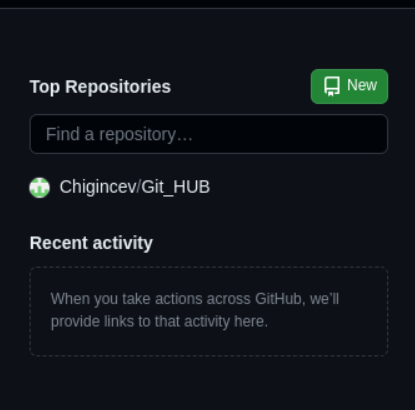
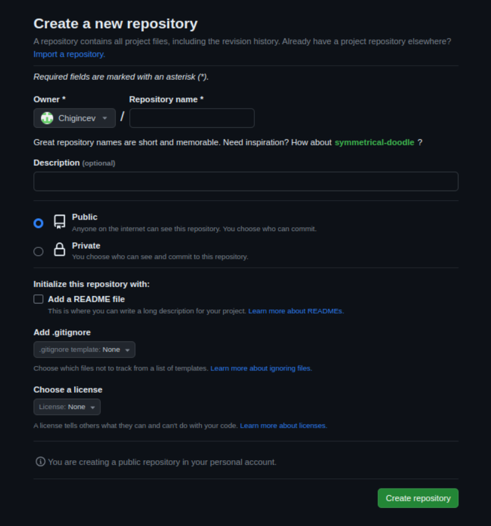

# GIT HUB
Для начала надо зарегистрироваться по ссылке на [git hub](https://github.com/signup?ref_cta=Sign+up&ref_loc=header+logged+out&ref_page=%2F&source=header-home) (незабывайте это вам в дальнейшем пригодиться, думайте над ником хорошо)

После успешной регистрации и подтверждение почты можем приступить к использованию.

## Создадим репозиторий 

Заходим на главную страницу слева будет вкладка "Top Repositories" 

 Заполняем необходимое поле это "Repository name"

 Если нужно оставляем комментарий "Description (optional)"

 Выбираем публичный/закрытый репозиторий

 И нажимаем create repositori
 
 ---

Выбираем что для вас больше подходит и компируем, вставляем в ваш редактор.

## Команды

    git clone - эта команда позволяет склонировать внешний репозиторий на наш ПК
---
    git pull - эта команда позволяет скачать все из текущего репозитория и автоматически сделать merge с нашей версией
---
    git push - эта команда позволяет отправить нашу версию репозитория на внешний репозиторий. ТРЕБУЕТ АВТОРИЗАЦИИ на внешнем репозитории.
---

